**Questions:**

1. Write an SQL query to retrieve the names and emails of all customers.

```sql
SELECT CONCAT(FirstName,' ',LastName) AS Name,EMail
FROM Customers;
```

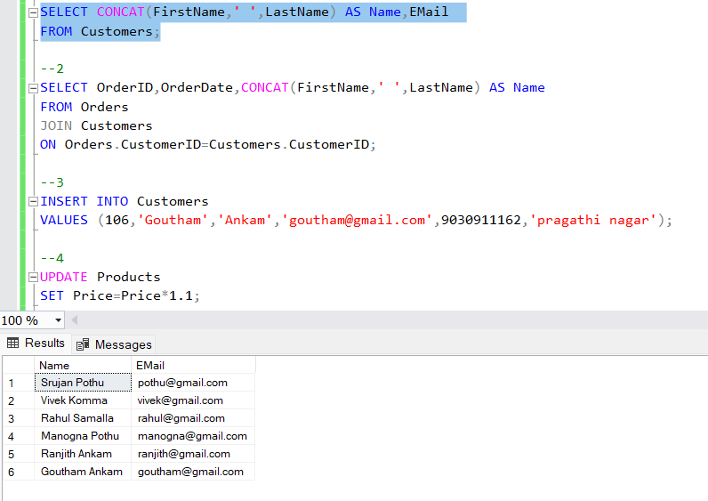

2. Write an SQL query to list all orders with their order dates and corresponding customer names.

```sql
SELECT OrderID,OrderDate,CONCAT(FirstName,' ',LastName) AS Name
FROM Orders
JOIN Customers
ON Orders.CustomerID=Customers.CustomerID;
```

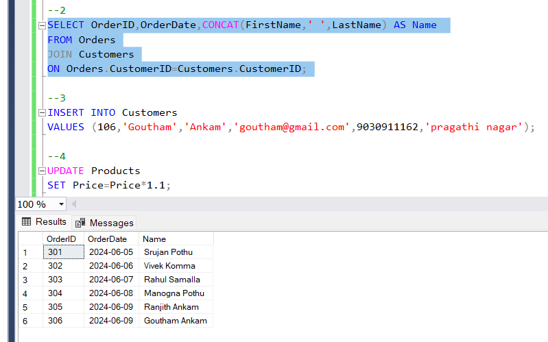

3. Write an SQL query to insert a new customer record into the "Customers" table. Include customer information such as name, email, and address.

```sql
INSERT INTO Customers
VALUES (107,'Rakesh','Ankam','rakesh@gmail.com',8898233726,'LB nagar',NULL);
```

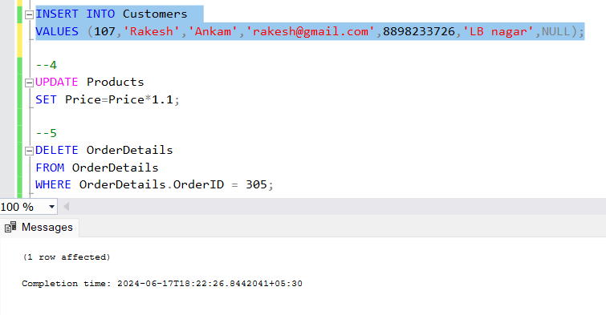

4.  Write an SQL query to update the prices of all electronic gadgets in the "Products" table by increasing them by 10%.

```sql
UPDATE Products
SET Price=Price*1.1;
```

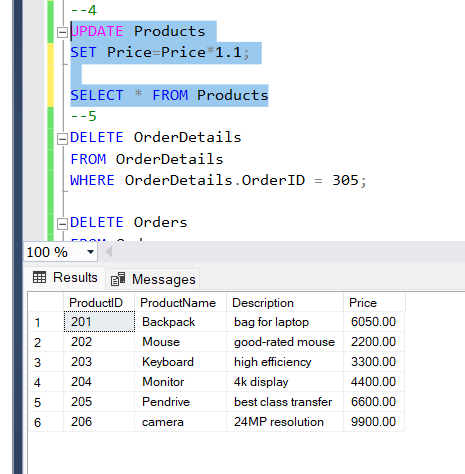

5. Write an SQL query to delete a specific order and its associated order details from the "Orders" and "OrderDetails" tables. Allow users to input the order ID as a parameter.

```sql
DELETE OrderDetails
FROM OrderDetails
WHERE OrderDetails.OrderID = 305;

DELETE Orders
FROM Orders
WHERE Orders.OrderID = 305;
```

```sql
DECLARE @ip INT
SET @ip=302

DELETE FROM Orders
WHERE OrderID=@ip;

DELETE FROM OrderDetails
WHERE OrderID=@ip;
```

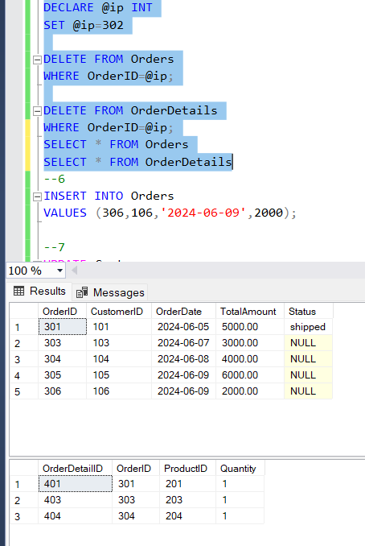

6. Write an SQL query to insert a new order into the "Orders" table. Include the customer ID, order date, and any other necessary information.

```sql
INSERT INTO Orders
VALUES (306,106,'2024-06-09',2000);
```

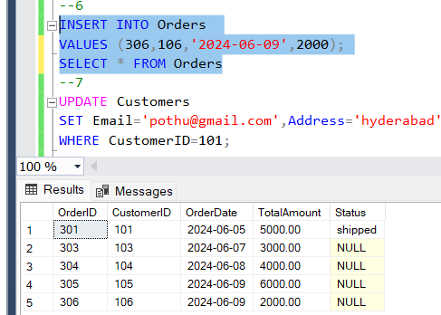

7.  Write an SQL query to update the contact information (e.g., email and address) of a specific customer in the "Customers" table. Allow users to input the customer ID and new contact information.

```sql
UPDATE Customers
SET Email='pothu@gmail.com',Address='hyderabad'
WHERE CustomerID=101;
```

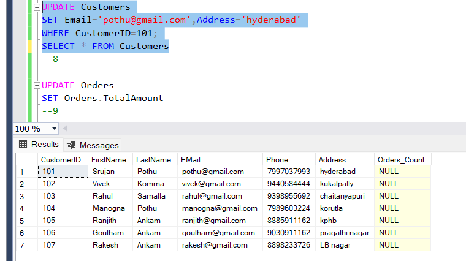

8. Write an SQL query to recalculate and update the total cost of each order in the "Orders" table based on the prices and quantities in the "OrderDetails" table.

```sql
UPDATE Orders
SET  Orders.TotalAmount = test.new
from Orders
inner join (
    SELECT od.OrderID,SUM(p.Price * od.Quantity) as new
    FROM OrderDetails od
	join products as p on od.ProductID = p.ProductID
	join orders as o on o.OrderID = od.orderID
    WHERE od.ProductID = p.ProductID
	group by od.OrderID)
	as test on Orders.OrderID = test.OrderID
```

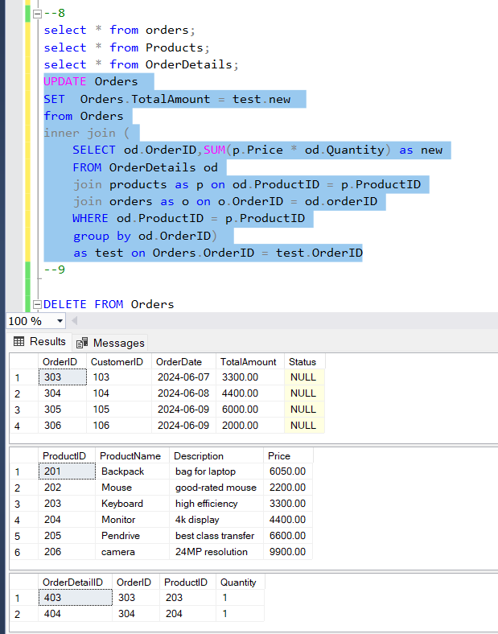

9. Write an SQL query to delete all orders and their associated order details for a specific customer from the "Orders" and "OrderDetails" tables. Allow users to input the customer ID as a parameter.

```sql
DELETE FROM Orders
WHERE OrderID = 301;
DELETE FROM OrderDetails
WHERE OrderID = 301;
SELECT * FROM Orders
SELECT * FROM OrderDetails
```

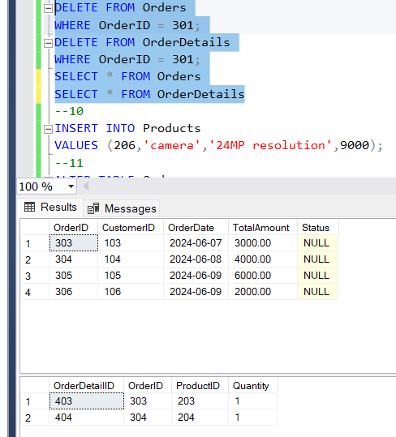

10. Write an SQL query to insert a new electronic gadget product into the "Products" table, including product name, category, price, and any other relevant details.

```sql
INSERT INTO Products
VALUES (206,'camera','24MP resolution',9000);
```

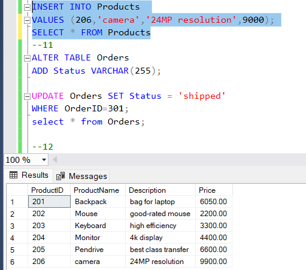

11. Write an SQL query to update the status of a specific order in the "Orders" table (e.g., from "Pending" to "Shipped"). Allow users to input the order ID and the new status.

```sql
ALTER TABLE Orders
ADD Status VARCHAR(255);

UPDATE Orders SET Status = 'shipped'
WHERE OrderID=301;
select * from Orders;
```

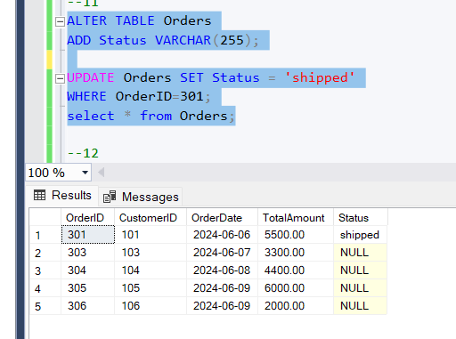

12. Write an SQL query to calculate and update the number of orders placed by each customer in the "Customers" table based on the data in the "Orders" table.

```sql
--12
alter table customers add Count_of_Orders int default 0 ;

update Customers
set Customers.Orders_Count=new.No_Of_Orders
from Customers c
JOIN (select CustomerID,count(OrderID) as No_Of_Orders
	  from Orders
	  group by CustomerID) as new
	  ON c.CustomerID = new.CustomerID


	  SELECT * FROM customers;
```

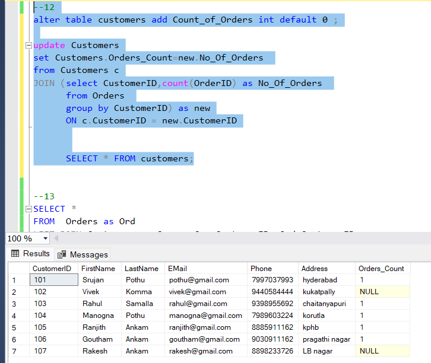

13. Write an SQL query to retrieve a list of all orders along with customer information (e.g., customer name) for each order.

```sql
SELECT *
FROM  Orders as Ord
LEFT JOIN Customers as Cus on Cus.CustomerID =Ord.CustomerID;
```

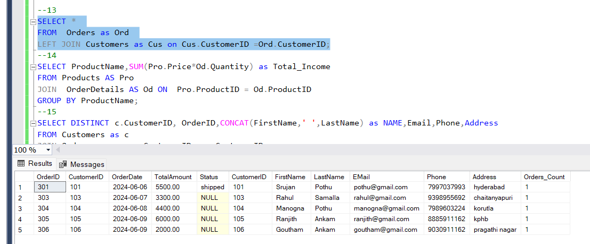

14. Write an SQL query to find the total revenue generated by each electronic gadget product. Include the product name and the total revenue.

```sql
SELECT ProductName,SUM(Pro.Price*Od.Quantity) as Total_Income
FROM Products AS Pro
JOIN  OrderDetails AS Od ON  Pro.ProductID = Od.ProductID
GROUP BY ProductName;
```

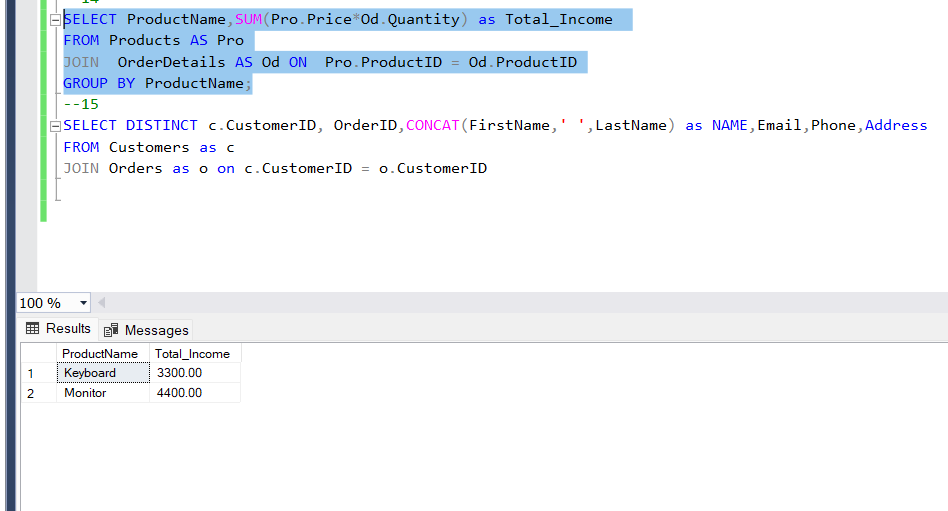

15. Write an SQL query to list all customers who have made at least one purchase. Include their names and contact information.

```sql
SELECT DISTINCT c.CustomerID, OrderID,CONCAT(FirstName,' ',LastName) as NAME,Email,Phone,Address
FROM Customers as c
JOIN Orders as o on c.CustomerID = o.CustomerID
```

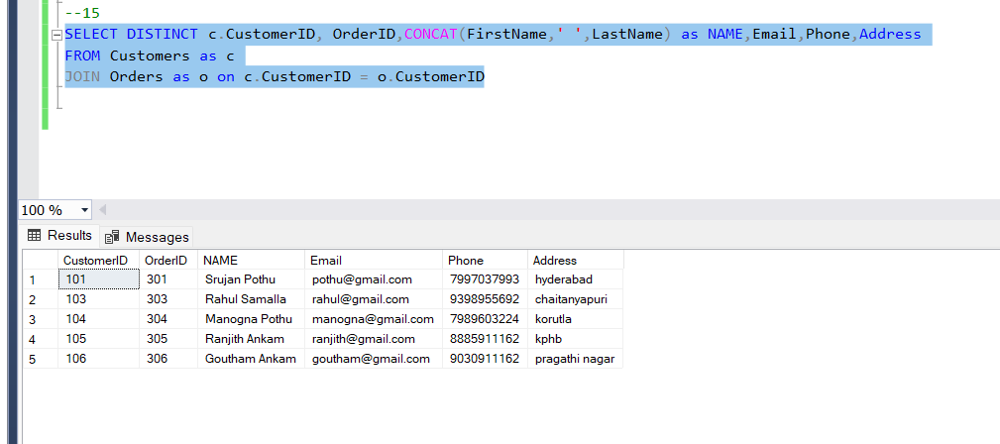
